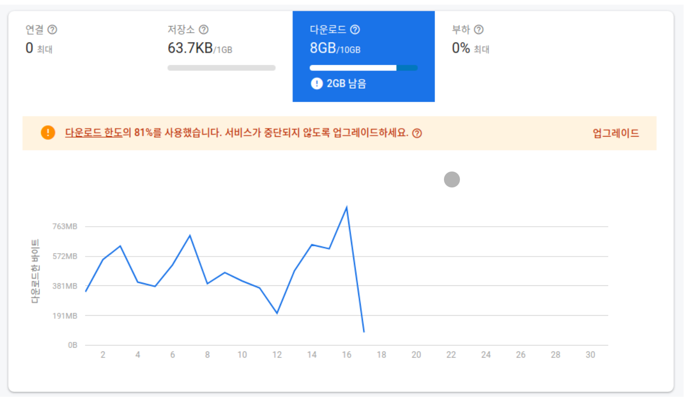
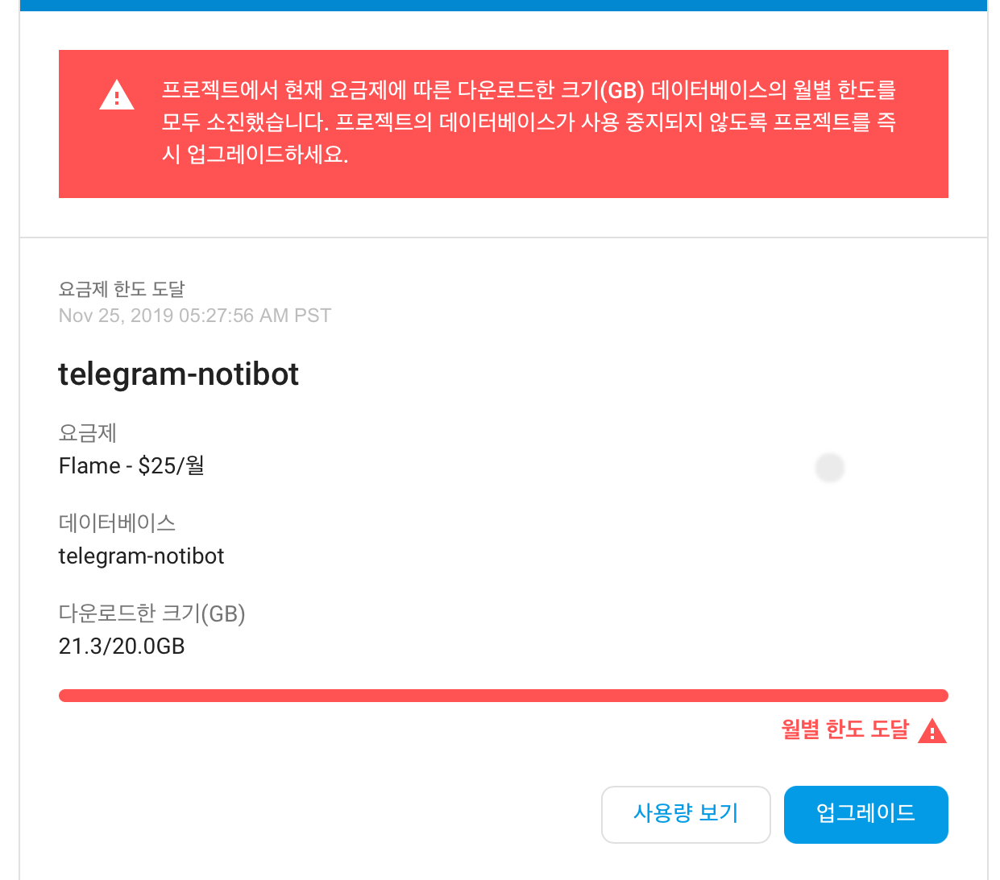

# 20250306 - 텔레그램 키워드 알림 봇 개발기 2

이 봇을 배포해놓고서 두 가지 이슈가 있었다.

## 데이터베이스 터뜨리기

봇을 3월에 배포하고, 같은 해 10월에 사용하던 Firebase에서 "데이터베이스 한도 근접"이라는 타이틀로 메일을 받았다.

이게 어찌 된 일이지? 로그를 확인해보니 평소보다 훨씬 많은 횟수로 봇의 API가 호출되어 있었다. 혹시 내 봇 인기만점인가?
메일을 받았을 당시 월 중순 즈음이여서, 남은 기간동안 봇을 운영할 수 없을 게 더 걱정되었던 나는 무료로 사용하던 데이터베이스를 유료 요금제로 전환했다.
돈이 없던 나는 25달러를 순식간에 지불하고 말았다.

다행히 25달러가 당장 내 목을 옥죄어오는 정도는 아니였고, 내 서비스를 운영한다는 기쁨이 더 컸던 나는 유료 요금제를 결제해 두고 뿌듯해했다.

그러나 바로 다음 달 유료로 업그레이드했던 사용량이 바로 한도에 도달했다.
이 날은 메일 확인이 늦어서 데이터베이스가 결국 중단됐고, 다음 날이 되어서야 봇이 멈춘 걸 알았다.
이제서야 코드에 뭔가 문제가 있다는 생각이 들었다.

NoSQL을 사용하면서, 정말로 JSON파일을 하나 가져와서 쓴다는 생각을 했던 나는
매 요청마다 json의 루트를 요청하여 데이터 전체를 받아온 다음에 서버 코드 내에서 id 조회 처리를 했던 것이었다.
봇 동작 구조 상 메시지 한 개당 데이터 조회가 반복되는 구조이기에 텍스트 데이터 뿐이였지만 금방 사용량이 늘어버린 것.

그리고 Firebase에서는 데이터를 조회할 때 shallow라는 옵션이 있는데.
이 옵션을 OFF하는 경우 조회한 데이터를 기준으로 하위 트리의 데이터를 전부 가져오고
ON하는 경우 조회한 데이터 기준의 1-depth 데이터만 가져온다.
이 shallow 옵션은 조회 함수 호출 시 기본값이 OFF이였고, API 명세를 제대로 확인하지 않은 나는
루트 경로의 데이터를 받아오면서 데이터베이스 전체에 해당되는 데이터를 매 그룹 대화방의 메시지마다 다운로드하고 있었던 것이다.

이미 유료 결제를 한 후였고, 당장의 서비스 재개를 위해 더 높은 플랜의 요금제를 결제하고 싶진 않았다.
블로그와 봇 내부 메시지로 서비스 사용 불가능을 안내했고 다음 달부터 개선된 코드로 봇을 다시 실행하고 유료 요금제를 무료로 다운그레이드했다.

## 텔레그램의 트래픽 제한

데이터베이스 사건을 해결하고 나서, 몇 년간 봇에 대해 잊고 지냈다.
특별한 기능을 가진 것도 아니었기 때문에 가만히 둔 채로 얼마든지 잘 사용되고 있었다.

그렇게 23년이 되었을 즘에 내 봇을 사용한다는 한 사람에게 메시지가 왔는데
봇의 알림 메시지가 딜레이가 심하다고 했다. 짧게는 10초에서 시간 단위로 늦게 오는 경우도 있고, 아예 알람이 안 오는 경우도 있다고 했다.
그리고 지금은 명령어조차 동작하지 않는다고 했다.
봇에 명령어를 입력해보았는데 정말 반응이 없었다.
AWS에 접속해 서버를 재실행해도 같았다...

텔레그램이 명령어를 실행하기 위한 API 서버는 내가 실행하고 있었지만,
기본적으로 텔레그램에서 제공하는 봇은 이런 별도의 API 서버를 운영하지 않고도 간단한 기능을 제공한다.
그 기본적인 껍데기에 해당되는 봇의 실행은 텔레그램 자체에서 해 준다는 의미이다.

봇을 생성하는 것 자체에는 아무런 돈이 들지 않는다.
그렇다면 사용량 제한이 있을 것이 분명했다.
이런 것에 대해 전혀 감이 없던 상태로 서버를 돌리다가, 사용량이 트래픽 한도에 도달한 것이다.

머릿속으로 상상하기에, 봇이 API를 실행하지 못하고 대기 중이니까
실행 대상이 되는 내 서버를 종료하면 대기 중인 API 호출들이 모두 취소되어서 작업 큐가 모두 클리어되지 않을까?
수 차례 내 서버를 재실행했지만 아무것도 해결되지 않았다.
그도 당연할 게 텔레그램 봇 쪽에서 나한테 오기 전 단계에서부터 막히는 거니까..

내가 손댈 수 있는 영역을 벗어났다는 데 생각이 미치자. 그냥 에라 모르겠다를 시전했다.
문의를 줬던 사람에게는 텔레그램 자체의 제한으로 생기는 문제라고 저도 해결할 수 없는 문제라고 했다.
그리고 이후로 수 개월 봇을 방치해버렸다.

봇에 대한 명령어 실행이 큐처럼 지속적으로 쌓이는 건지 뭔지, 시간이 지날 수록 시간 단위로라도 반응하던 명령어들이
며칠이 지나도 반응하지 않는 것을 확인하고 서버를 닫기로 했다.
블로그에 올렸던 글을 수정하고, 봇의 이름에 "서비스 중단"을 붙였다.

굉장히 허무하게 프로젝트가 막을 내려버렸다.

---

나중에 알게 된 건데 텔레그램에서 돌린다는 그 봇 서버도 내 로컬 서버로 대체가 가능한 것 같더라.

[https://core.telegram.org/bots/api#using-a-local-bot-api-server](https://core.telegram.org/bots/api#using-a-local-bot-api-server)
[https://github.com/tdlib/telegram-bot-api?tab=readme-ov-file#moving-a-bot-to-a-local-server](https://github.com/tdlib/telegram-bot-api?tab=readme-ov-file#moving-a-bot-to-a-local-server)

이걸 위해 따로 서버도 굴려야 하고, 애당초 동작 방식 자체가 효율적이지가 않다고 느꼈기에(매 대화마다 데이터를 이리저리 호출하면서 정규식 탐색 처리)
들이는 노력 대비 만족스러운 아웃풋이 나올 것 같지가 않다.
블로그에는 개선 작업을 "미루고 있다"고 적었는데, 앞으로도 딱히 뭔가 하진 않을 것 같다.
