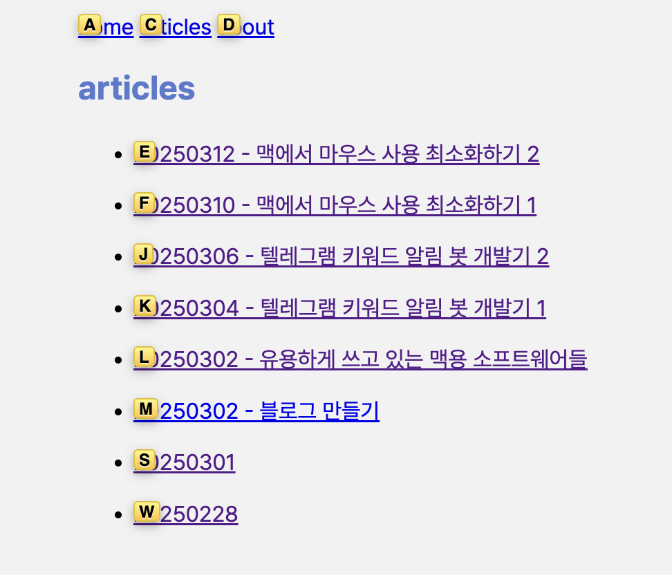
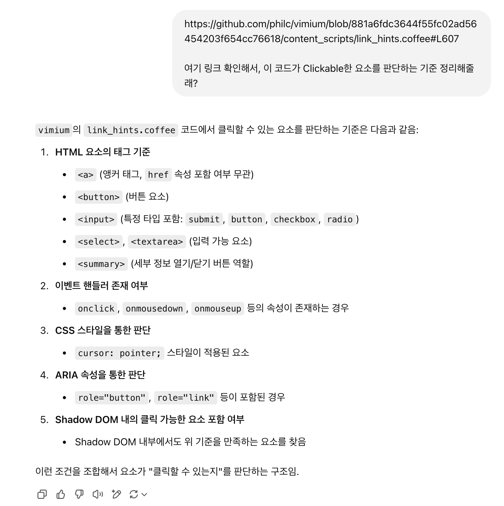
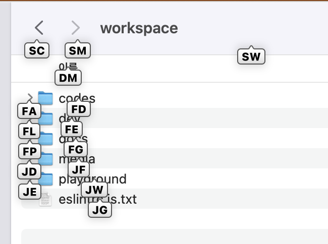
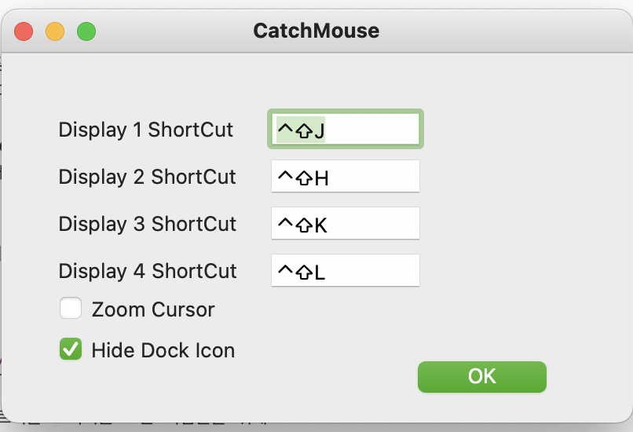

# 20250312 - 맥에서 마우스 사용 최소화하기 2

Visual Studio Code에서는 내가 원하는 방식대로 키맵핑을 바꾸면서 거의 대부분의 상황에 마우스 커서를 움직이지 않게 되었다.
하지만 VSCode를 끄고 나면 거의 대부분의 상황에서 다시 마우스를 움직여야 했다.
새로운 솔루션들이 더 필요했다.

## Vimium, Homerow

[20250302 - 유용하게 쓰고 있는 맥용 소프트웨어들](/articles/202503/20250302/20250302%20-%20유용하게%20쓰고%20있는%20맥용%20소프트웨어들)

위 포스트에서 먼저 소개했던 툴들인데 내 마우스 안 쓰기에 가장 영향을 많이 준 두 가지이다.

### Vimium

[https://chromewebstore.google.com/detail/vimium/dbepggeogbaibhgnhhndojpepiihcmeb?hl=ko](https://chromewebstore.google.com/detail/vimium/dbepggeogbaibhgnhhndojpepiihcmeb?hl=ko)

Vimium은 웹 브라우저 확장 프로그램으로, Chromium 기반 브라우저에서 사용이 가능하다.

웹 페이지에서 `F`키를 누르면 클릭 가능한 요소에 알파벳을 붙인 라벨이 표시되는데,
클릭하려는 요소에 붙은 라벨에 있는 알파벳을 누르면 클릭이 된다.
`HJKL`키를 이용한 화면 스크롤도 지원하기 때문에, 마우스 스크롤을 이용할 필요도 없다.

[Vimium의 소스 코드](https://github.com/philc/vimium/blob/881a6fdc3644f55fc02ad56454203f654cc76618/content_scripts/link_hints.coffee#L607)를 확인해 보면 다양한 기준을 가지고 버튼으로 동작하는 요소들을 찾는데.
어떤 홈페이지는 분명 버튼인데도 Vimium이 감지하지 못하는 경우가 있다.
웹 접근성의 중요성에 대해 실감하는 순간이였다.

이외에도 class 이름 조건들도 있긴 한데, 어쨌든 그냥 아무것도 없이 div태그로만 만들면 Vimium이 인식하지 못 한다.

### Homerow

[https://www.homerow.app/](https://www.homerow.app/)

Homerow는 MacOS 전반에서 Vimium처럼 클릭 가능한 요소를 찾고, `HJKL` 키를 이용한 스크롤을 지원하는 툴이다.
Vimium에 한참 익숙해진 내가 웹 브라우저 바깥의 환경에서도 비슷한 기능을 쓰고 싶어서 웹 검색을 하다가 찾게 되었다.

이렇게 Finder에서도 사용이 가능하다.
마찬가지로 특정한 기준을 가지고 요소들을 탐색하는데, 소스 코드가 공개되어있지 않아서 정확힌 모르겠다.
하지만 브라우저 내에서도 동작하고, Vimium보다 기준치가 낮기(?) 때문에 Vimium으로 클릭할 수 없는 요소에 동작하기도 한다.

기본적으로 무료이고, 단축키 활성화를 50번 할 때마다 화면 하단에 작은 광고 프롬프트가 뜨는데 바로 ESC로 닫을 수 있어서 불편하진 않다.

## Karabiner

"맥 한영키"로 구글에 검색하면 등장하는 필수 프로그램으로 여겨지는 카라비너.
나는 한영키를 바꾸는 것과 동시에 다양한 키를 바꾸어 사용한다.

Vimium 방향키에서 영감을 받아 Control, Command, Option 키 등의 조합과 `HJKL` 키를 이용해
미션 컨트롤에서 전환할 수 있는 "데스크탑"을 이동하는 단축키를 등록했다.

그리고 Function열의 단축키로 쓸 수 있는
볼륨 업/다운, 미디어 이전/다음/재생 등도 다른 키로 키맵핑하여 미니 배열 키보드에서의 미디어 제어도 편리하게 한다.

## CatchMouse

[https://github.com/round/CatchMouse](https://github.com/round/CatchMouse)

디스플레이를 여러 개 연결해 듀얼-트리플 모니터를 쓰는 사람들을 위해
마우스 커서를 빠르게 각 디스플레이로 이동할 수 있게 하는 도구,

Homerow를 통해 전반적인 화면 요소들을 다 제어할 순 있지만, 이건 현재 활성화된 디스플레이 안에서만 동작하기 때문에
디스플레이 간 포커스를 이동하기 위해서 이 프로그램이 쏠쏠하다.

카라비너를 이용해서 마우스 클릭을 동작시키는 단축키 하나 만들어두고
CatchMouse로 커서 이동 -> 클릭 단축키 입력 이면 다른 디스플레이로 포커스를 바로 이동시킬 수 있다. '

---

다니던 회사에서 이런 세팅들을 하나씩 동료들한테 알려주면서 권유해본 적이 있었는데 제대로 팔린 적은 없긴 했다.
그만큼 굉장히 매니악한 세팅이긴 한데.. 나같은 누군가에겐 유용한 정보 공유일 수도 있지 않을까?
